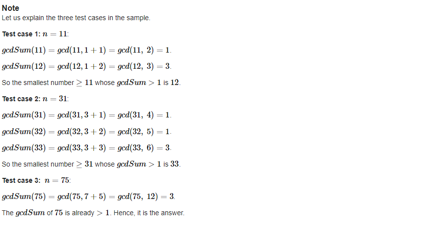

## [[A] GCD Sum](https://codeforces.com/contest/1498/problem/A)


___
## 문제 해설
- X가 주어지면, X의 각 digit을 더한 값과 gcd(최대공약수)를 찾는 데, 아래의 조건을 만족해야 한다.
    - gcd가 2 이상인 최소의 X를 찾아라.
    - gcd가 1이면 X를 1 증가시켜서 gcd를 구하여라.
___
## 풀이
- `3의 배수는 항상 모든 digit의 합이 3의 배수가 나온다`는 점을 이용하자.
```c++
long long gcdSum(const long long& X) {
	long long tmp = X;
	long long digitSum = 0;

	while (tmp) {
		digitSum += tmp % 10;
		tmp /= 10;
	}

	return gcd(X, digitSum);
}

int main(){
    ...
    if (gcdSum(X) != 1)
			cout << X << '\n';
		else if (gcdSum(X + 1) != 1)
			cout << X + 1 << '\n';
		else if (gcdSum(X + 2) != 1)
			cout << X + 2 << '\n';	
    ...
}
```
- gcd는 `유클리드 호제법`을 이용하여 구하자.
```c++
long long gcd(const long long& a, const long long& b) {
	long long A = a, B = b;
	if (a < b) {
		long long tmp = A;
		A = b;
		B = tmp;
	}

	while (A % B) {
		long long r = A % B;
		A = B;
		B = r;
	}

	return B;
}
```