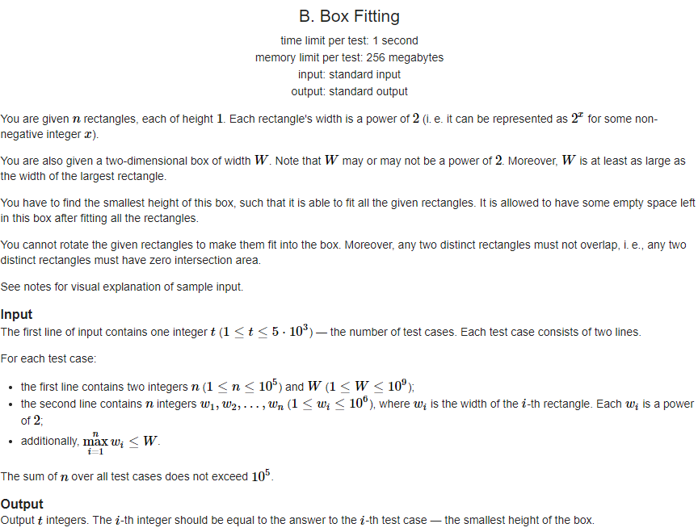
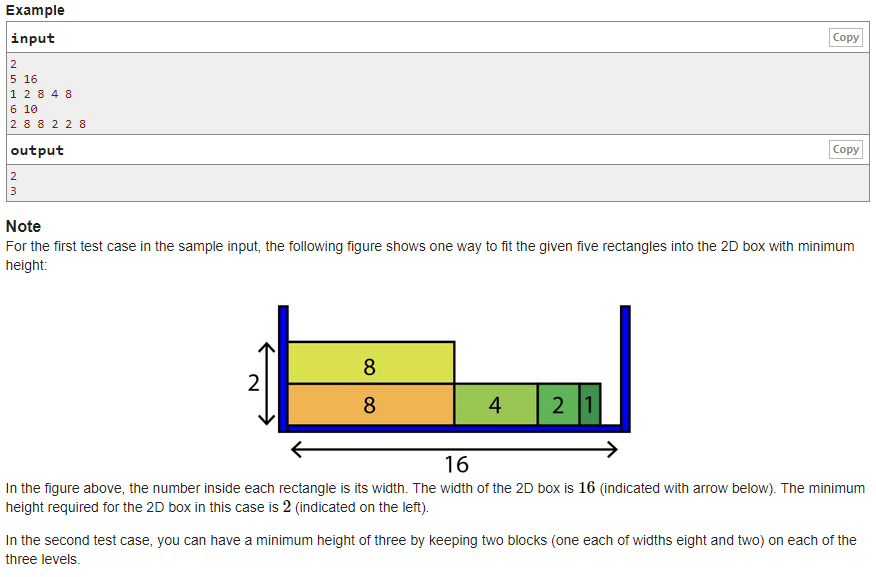

## [[B] Box Fitting](https://codeforces.com/contest/1498/problem/B)


___
## 문제 해설
- 입력으로 받은 높이가 1이고 2의 거듭제곱 너비의 직사각형들을 box에 집어넣었을 때, 가장 최소의 높이를 구하여라.
___
## 풀이
- 2의 각 0~19승의 개수를 담기 위해 arr배열을 이용하였다.
```c++
for (int i = 0; i < n; i++) {
	int num;
	cin >> num;
	arr[(int)log2(num)]++;
}
```
- 가장 큰 직사각형부터 모조리 소진하면서 내림차순으로 사용해야 가장 최소의 높이로 box를 채울 수 있다.
- 2^19부터 2^0까지 돌았을 때, 더 이상 box에 직사각형을 채울 수 없다면 높이를 1 증가시켜야 한다.
```c++
int h = 1, space_left = w;
while (n) {
	int largest = -1
	for (int power = 19; power >= 0; power--) {
        // (1 << power) : 2^power
		if (arr[power] && (1 << power) <= space_left) {
			largest = power;
			n--;
			break;
		}
	
	if (largest == -1) {
		space_left = w;
		h++;
		for (int power = 19; power >= 0; power--) {
			if (arr[power] && (1 << power) <= space_left) {
				largest = power;
				n--;
				break;
			}
		}
	}
	
	arr[largest]--;
	space_left -= (1 << largest);
}
```