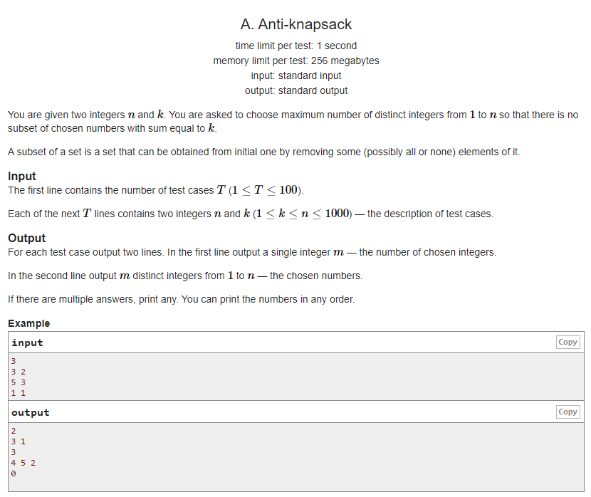

## **[[A] Anti-knapsack](https://codeforces.com/contest/1493/problem/A)**

___
## 문제 해설
- 1 부터 n 까지의 정수가 주어졌을 때, 합이 k가되는 distinct integers 중 한 정수를 제외한 부분집합을 찾는 문제이다.<br> (즉, 임의의 두 정수를 더했을 때, 합이 k가 되지 않는 부분집합을 찾는 것!)
- 물론 정수 k도 제외해야 한다.
___
## 풀이
- `k` 와 `k/2 이하의 정수를 제거`해야 한다.
    > 예를들어, n = 5, k = 4 이라고 해보자.<br>
    > 집합 S = {1, 2, 3, 4, 5} 이고, 합이 4가 되지 않는 부분집합은 아래와 같다.<br>
    > s = {2, 3, 5}<br>
    > - 1 + 3 = 4 이므로 1 제외<br>
    > - 2 + 2 = 4 는 distinct integers 가 아니므로 pass<br>
    > - k = 4 제외
```c++
vector<int> v;
for (int i = 1; i <= n; i++) {
	if(i >= ceil((double)k / 2) && i != k)
	v.push_back(i);
}
```